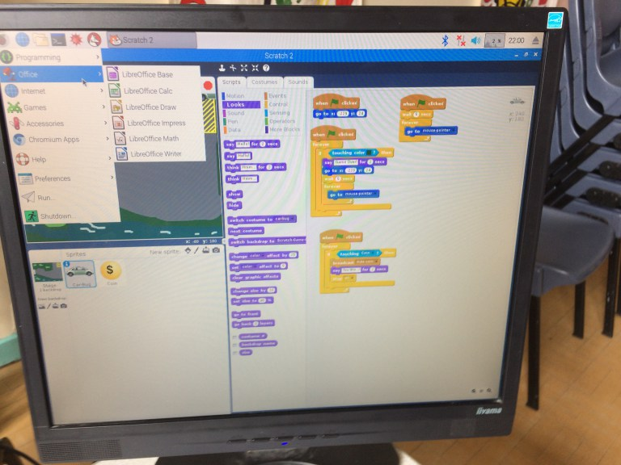
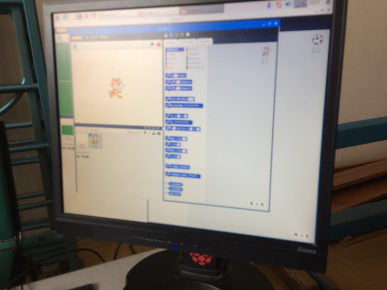

<title>York Pi Jam</title>

## Welcome to York Pi Jam

Welcome to York Pi Jam's website. We are next attending the York Raspberry Jam on May 21st 2018. 
<form action="https://www.eventbrite.co.uk/e/york-raspberry-jam-tickets-44586926698?aff=es2">
    <input type="submit" value="Get Tickets Now" />
</form>

### Where is it held?

The current jam is being held at:
<iframe src="https://www.google.com/maps/embed?pb=!1m18!1m12!1m3!1d2347.762959263335!2d-1.1314846844083217!3d53.95371798011078!2m3!1f0!2f0!3f0!3m2!1i1024!2i768!4f13.1!3m3!1m2!1s0x4879312f4b6ea0ad%3A0x75c4f02e2b136e55!2sAcomb+Explore+Library!5e0!3m2!1sen!2suk!4v1525604261578" width="600" height="450" frameborder="0" style="border:0" allowfullscreen></iframe>

### Gallery Of Pictures

Pictures from 24th March 2018 at Robert Wilkinson Primary Academy, Strensall, York.

### Support or Contact

Having trouble with Pages? Check out our [documentation](https://help.github.com/categories/github-pages-basics/) or [contact support](https://github.com/contact) and we’ll help you sort it out.
